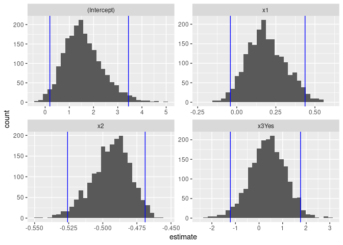

Activity 9 - Bootstrapping
================

## Load the necessary packages

``` r
library(tidyverse)
```

    ## ── Attaching packages ─────────────────────────────────────── tidyverse 1.3.2 ──
    ## ✔ ggplot2 3.3.6     ✔ purrr   0.3.4
    ## ✔ tibble  3.2.1     ✔ dplyr   1.1.1
    ## ✔ tidyr   1.2.0     ✔ stringr 1.4.1
    ## ✔ readr   2.1.2     ✔ forcats 0.5.2
    ## ── Conflicts ────────────────────────────────────────── tidyverse_conflicts() ──
    ## ✖ dplyr::filter() masks stats::filter()
    ## ✖ dplyr::lag()    masks stats::lag()

``` r
library(tidymodels)
```

    ## ── Attaching packages ────────────────────────────────────── tidymodels 1.0.0 ──
    ## ✔ broom        1.0.0     ✔ rsample      1.1.0
    ## ✔ dials        1.0.0     ✔ tune         1.0.0
    ## ✔ infer        1.0.3     ✔ workflows    1.0.0
    ## ✔ modeldata    1.0.0     ✔ workflowsets 1.0.0
    ## ✔ parsnip      1.0.1     ✔ yardstick    1.0.0
    ## ✔ recipes      1.0.1     
    ## ── Conflicts ───────────────────────────────────────── tidymodels_conflicts() ──
    ## ✖ scales::discard() masks purrr::discard()
    ## ✖ dplyr::filter()   masks stats::filter()
    ## ✖ recipes::fixed()  masks stringr::fixed()
    ## ✖ dplyr::lag()      masks stats::lag()
    ## ✖ yardstick::spec() masks readr::spec()
    ## ✖ recipes::step()   masks stats::step()
    ## • Learn how to get started at https://www.tidymodels.org/start/

## Create the data

``` r
# Create a data frame/tibble named sim_dat
sim_dat <- tibble(
# Explain what next line is doing
  x1 = runif(20, -5, 5),
# Explain what next line is doing
  x2 = runif(20, 0, 100),
# Explain what next line is doing
  x3 = rbinom(20, 1, 0.5)
  )

b0 <- 2
b1 <- 0.25
b2 <- -0.5
b3 <- 1
sigma <- 1.5

errors <- rnorm(20, 0, sigma)

sim_dat <- sim_dat %>% 
  mutate(
    y = b0 + b1*x1 + b2*x2 + b3*x3 + errors,
    x3 = case_when(
      x3 == 0 ~ "No",
      TRUE ~ "Yes"
      )
    )
```

## Traditional MLR model

``` r
mlr_fit <- linear_reg() %>%
  set_mode("regression") %>% 
  set_engine("lm") %>% 
  fit(y ~ x1 + x2 + x3, data = sim_dat)

# Also include the confidence intervals for our estimated slope parameters
tidy(mlr_fit, conf.int = TRUE)
```

    ## # A tibble: 4 × 7
    ##   term        estimate std.error statistic  p.value conf.low conf.high
    ##   <chr>          <dbl>     <dbl>     <dbl>    <dbl>    <dbl>     <dbl>
    ## 1 (Intercept)    1.62     0.707      2.29  3.57e- 2   0.123      3.12 
    ## 2 x1             0.179    0.110      1.62  1.25e- 1  -0.0552     0.413
    ## 3 x2            -0.495    0.0128   -38.6   3.20e-17  -0.522     -0.468
    ## 4 x3Yes          0.407    0.698      0.583 5.68e- 1  -1.07       1.89

## Bootstrapping

``` r
# Set a random seed value so we can obtain the same "random" results
set.seed(631)

# Generate the 2000 bootstrap samples
boot_samps <- sim_dat %>% 
  bootstraps(times = 2000)

boot_samps
```

    ## # Bootstrap sampling 
    ## # A tibble: 2,000 × 2
    ##    splits          id           
    ##    <list>          <chr>        
    ##  1 <split [20/8]>  Bootstrap0001
    ##  2 <split [20/6]>  Bootstrap0002
    ##  3 <split [20/6]>  Bootstrap0003
    ##  4 <split [20/6]>  Bootstrap0004
    ##  5 <split [20/10]> Bootstrap0005
    ##  6 <split [20/10]> Bootstrap0006
    ##  7 <split [20/7]>  Bootstrap0007
    ##  8 <split [20/6]>  Bootstrap0008
    ##  9 <split [20/8]>  Bootstrap0009
    ## 10 <split [20/6]>  Bootstrap0010
    ## # … with 1,990 more rows

``` r
boot_samps$splits[[1]] %>% analysis()
```

    ## # A tibble: 20 × 4
    ##         x1     x2 x3         y
    ##      <dbl>  <dbl> <chr>  <dbl>
    ##  1 -4.97   78.6   Yes   -36.4 
    ##  2  2.18   64.1   No    -27.7 
    ##  3 -3.50   61.6   No    -29.3 
    ##  4  3.52   12.8   Yes    -3.39
    ##  5 -4.90   76.3   No    -37.5 
    ##  6 -0.903   1.02  No     -1.18
    ##  7 -4.91   33.1   Yes   -12.8 
    ##  8 -0.0686 67.1   Yes   -33.1 
    ##  9 -2.37   76.0   No    -35.5 
    ## 10  4.59    0.949 No      3.94
    ## 11  4.59    0.949 No      3.94
    ## 12  1.20   36.8   Yes   -15.3 
    ## 13 -0.160  86.3   No    -40.2 
    ## 14 -2.37   76.0   No    -35.5 
    ## 15 -4.97   78.6   Yes   -36.4 
    ## 16  2.18   64.1   No    -27.7 
    ## 17  3.52   12.8   Yes    -3.39
    ## 18 -4.90   76.3   No    -37.5 
    ## 19  3.52   12.8   Yes    -3.39
    ## 20 -4.90   76.3   No    -37.5

``` r
# Create a function that fits a fixed MLR model to one split dataset
fit_mlr_boots <- function(split) {
  lm(y ~ x1 + x2 + x3, data = analysis(split))
}

# Fit the model to each split and store the information
# Also, obtain the tidy model information
boot_models <- boot_samps %>% 
  mutate(
    model = map(splits, fit_mlr_boots),
    coef_info = map(model, tidy)
    )

boots_coefs <- boot_models %>% 
  unnest(coef_info)

boots_coefs
```

    ## # A tibble: 8,000 × 8
    ##    splits         id            model  term     estim…¹ std.e…² stati…³  p.value
    ##    <list>         <chr>         <list> <chr>      <dbl>   <dbl>   <dbl>    <dbl>
    ##  1 <split [20/8]> Bootstrap0001 <lm>   (Interc…  1.84    0.793    2.32  3.39e- 2
    ##  2 <split [20/8]> Bootstrap0001 <lm>   x1        0.305   0.118    2.59  1.97e- 2
    ##  3 <split [20/8]> Bootstrap0001 <lm>   x2       -0.486   0.0138 -35.1   1.43e-16
    ##  4 <split [20/8]> Bootstrap0001 <lm>   x3Yes     0.460   0.628    0.732 4.75e- 1
    ##  5 <split [20/6]> Bootstrap0002 <lm>   (Interc…  1.19    0.589    2.02  6.08e- 2
    ##  6 <split [20/6]> Bootstrap0002 <lm>   x1        0.209   0.122    1.71  1.06e- 1
    ##  7 <split [20/6]> Bootstrap0002 <lm>   x2       -0.496   0.0169 -29.3   2.49e-15
    ##  8 <split [20/6]> Bootstrap0002 <lm>   x3Yes     0.680   0.885    0.768 4.53e- 1
    ##  9 <split [20/6]> Bootstrap0003 <lm>   (Interc…  1.48    0.619    2.39  2.93e- 2
    ## 10 <split [20/6]> Bootstrap0003 <lm>   x1        0.0986  0.100    0.986 3.39e- 1
    ## # … with 7,990 more rows, and abbreviated variable names ¹​estimate, ²​std.error,
    ## #   ³​statistic

``` r
boot_int <- int_pctl(boot_models, statistics = coef_info, alpha = 0.05)
boot_int
```

    ## # A tibble: 4 × 6
    ##   term         .lower .estimate .upper .alpha .method   
    ##   <chr>         <dbl>     <dbl>  <dbl>  <dbl> <chr>     
    ## 1 (Intercept)  0.194      1.59   3.44    0.05 percentile
    ## 2 x1          -0.0408     0.189  0.437   0.05 percentile
    ## 3 x2          -0.526     -0.494 -0.469   0.05 percentile
    ## 4 x3Yes       -1.22       0.364  1.76    0.05 percentile

``` r
ggplot(boots_coefs, aes(x = estimate)) +
  geom_histogram(bins = 30) +
  facet_wrap( ~ term, scales = "free") +
  geom_vline(data = boot_int, aes(xintercept = .lower), col = "blue") +
  geom_vline(data = boot_int, aes(xintercept = .upper), col = "blue")
```

<!-- -->
